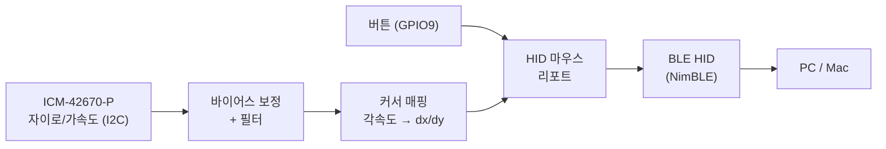

# esp32c3-airmouse

[ESP32-C3-DevKit-RUST-2](https://github.com/esp-rs/esp-rust-board) 보드로 만드는 BLE 에어마우스.

손에 들고 움직이면 내장 IMU(자이로/가속도)가 움직임을 감지하고, BLE HID 마우스로 페어링된 PC/맥의 커서를 움직입니다.

## 동작 방식

ESP32-C3의 USB는 Serial/JTAG 전용이라(USB OTG 미지원) USB 유선 마우스로는 동작할 수 없습니다. 그래서 **BLE HID(HOGP, HID over GATT)** 로 구현합니다.



## 하드웨어

ESP32-C3-DevKit-RUST-2 (esp-rust-board) 온보드 구성만으로 시작합니다.

| 구성 요소 | 사양 | 연결 |
|---|---|---|
| MCU | ESP32-C3 (RISC-V 160MHz, 4MB Flash, BLE 5.0) | — |
| IMU | ICM-42670-P (6축 자이로+가속도) | I2C 주소 `0x68` |
| 온습도 센서 | SHTC3 (이 프로젝트에서는 미사용) | I2C 주소 `0x70` |
| I2C 버스 | — | SDA=`GPIO7`, SCL=`GPIO8` |
| RGB LED | WS2812 (상태 표시용) | `GPIO2` |
| 단색 LED | — | `GPIO10` |
| 버튼 | BOOT 버튼 (클릭 입력으로 활용) | `GPIO9` (active-low) |
| 전원 | USB-C, LiPo 충전(MCP73831) | 배터리 전압 측정은 미지원 |

> **주의 (RUST-2 개정판)**: RUST-1은 SDA=GPIO10 / LED=GPIO7이었지만, **RUST-2는 LED가 GPIO10으로 옮겨가면서 SDA가 GPIO7이 됐다.** Espressif 공식 문서의 핀 테이블에는 RUST-1 값이 남아 있는 오류가 있으며, 위 값은 실보드 I2C 스캔으로 확인한 것.

## 기술 스택

- **Rust std (ESP-IDF)** — [esp-idf-svc](https://github.com/esp-rs/esp-idf-svc) 기반
- **[esp32-nimble](https://github.com/taks/esp32-nimble)** — BLE HID (NimBLE 스택 래퍼)
- **[icm42670](https://github.com/jessebraham/icm42670)** — IMU 드라이버 (embedded-hal)

> no_std(esp-hal) 방식도 가능하지만, BLE HID는 std + NimBLE 조합이 예제와 레퍼런스가 훨씬 풍부해서 이쪽을 선택했습니다.

## 개발 환경 (macOS Apple Silicon)

ESP32-C3는 RISC-V라서 Xtensa용 포크 툴체인(espup) 없이 표준 Rust nightly로 빌드합니다.

```bash
# 1. Rust nightly + rust-src (rust-toolchain.toml이 자동으로 적용해주지만 미리 설치)
rustup toolchain install nightly --component rust-src

# 2. 빌드/플래시 도구
cargo install ldproxy espflash
```

첫 `cargo build`는 ESP-IDF(v5.3.3)와 크로스컴파일 툴체인을 `firmware/.embuild/` 아래에 자동으로 내려받기 때문에 10분 이상 걸릴 수 있습니다. 이후 빌드는 빠릅니다.

## 빌드 / 플래시

펌웨어는 `firmware/`가 cargo 프로젝트 루트이므로, 빌드 명령은 그 안에서 실행합니다.

```bash
cd firmware

# 빌드만
cargo build

# 빌드 + 플래시 + 시리얼 모니터 (보드를 USB-C로 연결)
cargo run
```

보드는 내장 USB Serial/JTAG로 인식되므로 별도 드라이버 없이 `/dev/cu.usbmodem*` 포트로 잡힙니다.

## 프로젝트 구조

```
.
├── README.md
├── CLAUDE.md
└── firmware/                # Rust 펌웨어 (cargo 프로젝트 루트 — 빌드는 여기서)
    ├── .cargo/config.toml   # 타겟(riscv32imc-esp-espidf), 링커, 러너, ESP-IDF 버전 고정
    ├── rust-toolchain.toml  # nightly + rust-src
    ├── sdkconfig.defaults   # ESP-IDF 설정 (NimBLE 활성화 포함)
    ├── build.rs             # embuild 연동
    └── src/main.rs
```

이후 케이스 도면(`hardware/`)이나 상세 문서(`docs/`)가 생기면 루트에 같은 레벨로 추가합니다.

## 로드맵

작업은 [GitHub 이슈](https://github.com/barmi/esp32c3-airmouse/issues) 단위로 진행합니다.

| 단계 | 내용 |
|---|---|
| 1 | 개발 환경 구축 및 Hello World 플래싱 |
| 2 | IMU(ICM-42670-P) 데이터 읽기 |
| 3 | BLE HID 마우스 프로파일 (HOGP) |
| 4 | 모션 → 커서 매핑 (센서 퓨전/감도 튜닝) |
| 5 | 버튼 클릭 |
| 6 | WS2812 상태 LED |
| 7 | 전원 관리 / 절전 |
| 8 | GitHub Actions CI |

## 참고 자료

- [esp-rust-board 보드 문서](https://github.com/esp-rs/esp-rust-board) — 핀맵, 회로도
- [The Rust on ESP Book](https://docs.esp-rs.org/book/)
- [esp-idf-svc examples](https://github.com/esp-rs/esp-idf-svc/tree/master/examples)
- [esp32-nimble examples](https://github.com/taks/esp32-nimble/tree/main/examples)
