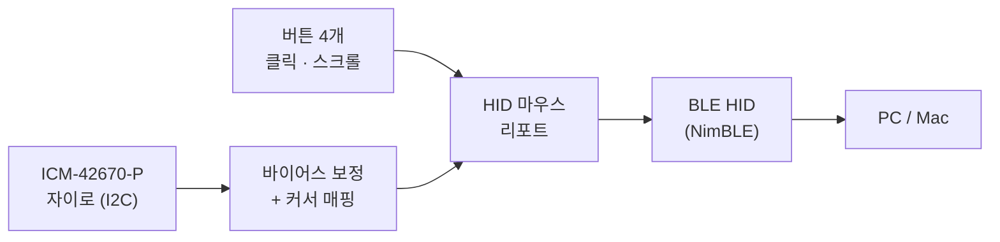

# esp32c3-airmouse

[ESP32-C3-DevKit-RUST-2](https://github.com/esp-rs/esp-rust-board) 보드로 만드는 BLE 에어마우스.

손에 들고 움직이면 내장 IMU가 손목 회전을 감지해 페어링된 PC/맥의 커서를 움직입니다. 커서 이동은 보드만으로 되고, 클릭과 스크롤은 택트 스위치 4개를 직접 답니다.



## 빠른 시작

보드에 전원을 넣고, LED가 **파랑 깜빡임**이 되면 Bluetooth 설정에서 **`ESP32C3 AirMouse`** 를 연결합니다. LED가 **초록**으로 바뀌면 커서가 움직입니다.

USB 커넥터가 모니터를 향하게 쥐고 손목을 좌우/상하로 돌리면 커서가 따라갑니다. 클릭과 스크롤은 [직접 배선한 택트 스위치 4개](docs/hardware.md#클릭과-스크롤-버튼-배선)(GPIO3~6)로 하고, 온보드 **BOOT 버튼**은 자이로 재캘리브레이션입니다.

| LED | 의미 |
|---|---|
| 🟠 주황 | 자이로 캘리브레이션 중 — **움직이지 마세요** (2~3초) |
| 🔵 파랑 깜빡임 | BLE 광고 중 — 호스트에서 연결하세요 |
| 🟢 초록 | 연결됨 — 정상 동작 |

자세한 내용은 **[사용법 문서](docs/usage.md)** 에 있습니다.

## 직접 빌드하기

```bash
cd firmware && cargo run
```

`cargo install ldproxy espflash`가 선행되어야 하며, 첫 빌드는 ESP-IDF를 내려받느라 10분 이상 걸립니다. 자세한 내용은 [개발 가이드](docs/development.md)를 보세요.

## 문서

| 문서 | 내용 |
|---|---|
| [사용법](docs/usage.md) | 페어링, LED 색깔 의미, 조작법, 문제 해결 |
| [튜닝 가이드](docs/tuning.md) | 커서 감도·방향·데드존 조정 |
| [하드웨어](docs/hardware.md) | 보드 스펙, 핀맵, IMU 특성 |
| [개발 가이드](docs/development.md) | 개발 환경, 빌드/플래시, CI |
| [코드 구조](docs/architecture.md) | 데이터 흐름, 모듈 구성, 설계 결정 |

## 기술 스택

- **Rust std (ESP-IDF)** — [esp-idf-svc](https://github.com/esp-rs/esp-idf-svc) 기반
- **[esp32-nimble](https://github.com/taks/esp32-nimble)** — BLE HID (NimBLE 스택 래퍼)
- **[icm42670](https://github.com/jessebraham/icm42670)** — IMU 드라이버 (embedded-hal)

ESP32-C3에는 USB OTG가 없어 USB 유선 마우스로는 동작할 수 없으므로 **BLE HID(HOGP)** 로 구현했습니다. no_std(esp-hal)도 가능하지만, BLE HID는 std + NimBLE 조합의 레퍼런스가 훨씬 풍부해 이쪽을 택했습니다.

## 프로젝트 구조

```
.
├── docs/                    # 문서 (위 표 참고)
├── .github/workflows/ci.yml # push/PR 검증 (fmt + release build + clippy)
└── firmware/                # Rust 펌웨어 (cargo 프로젝트 루트 — 빌드는 여기서)
    ├── .cargo/config.toml   # 타겟, 링커, 러너, ESP-IDF 버전 고정
    ├── rust-toolchain.toml  # nightly 고정 + 컴포넌트
    ├── sdkconfig.defaults   # ESP-IDF 설정 (NimBLE 등)
    └── src/
        ├── main.rs          # 초기화 + 100Hz 메인 루프
        ├── imu.rs           # IMU 읽기 + 자이로 캘리브레이션
        ├── mapping.rs       # 각속도 → 커서 이동 (튜닝 상수)
        ├── ble_hid.rs       # BLE HID 마우스 (HOGP)
        ├── button.rs        # 버튼 디바운스 + 스크롤 오토리피트
        └── status_led.rs    # WS2812 상태 표시
```

## 로드맵

작업은 [GitHub 이슈](https://github.com/barmi/esp32c3-airmouse/issues) 단위로 진행합니다.

| 단계 | 내용 | 상태 |
|---|---|---|
| 1 | 개발 환경 구축 및 Hello World 플래싱 | 완료 |
| 2 | IMU(ICM-42670-P) 데이터 읽기 | 완료 |
| 3 | BLE HID 마우스 프로파일 (HOGP) | 완료 |
| 4 | 모션 → 커서 매핑 (캘리브레이션/감도 튜닝) | 완료 |
| 5 | 버튼 클릭 | 완료 |
| 6 | WS2812 상태 LED | 완료 |
| 7 | 전원 관리 / 절전 | 예정 |
| 8 | GitHub Actions CI | 완료 |
| 9 | 우클릭 · 스크롤 버튼 | 배선 대기 |
