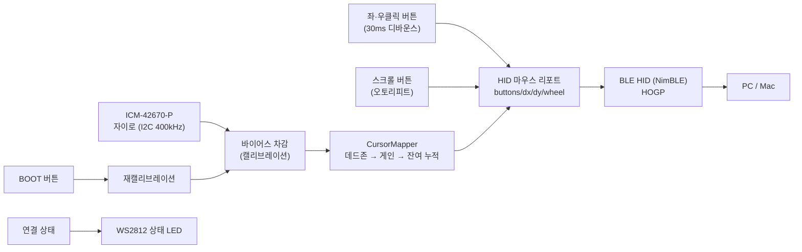

# 코드 구조

## 데이터 흐름



## 모듈

| 파일 | 역할 |
|---|---|
| [main.rs](../firmware/src/main.rs) | 초기화 순서와 100Hz 메인 루프 |
| [imu.rs](../firmware/src/imu.rs) | ICM-42670-P 설정·읽기, 자이로 바이어스 캘리브레이션 |
| [mapping.rs](../firmware/src/mapping.rs) | 각속도 → 커서 이동량. **튜닝 상수가 여기 모여 있음** |
| [ble_hid.rs](../firmware/src/ble_hid.rs) | BLE HID 마우스 — 리포트 디스크립터, 광고, 전송 |
| [button.rs](../firmware/src/button.rs) | 버튼 디바운스 + 스크롤 오토리피트 |
| [status_led.rs](../firmware/src/status_led.rs) | WS2812 상태 표시 |

## 부팅 순서

`main()`의 초기화 순서에는 이유가 있습니다.

1. **상태 LED 먼저** — 이후 단계가 실패해도 사용자가 진행 상황을 볼 수 있습니다.
2. **BLE 광고 시작** — 캘리브레이션(2.6초) 동안 호스트가 미리 연결을 시도할 수 있습니다.
3. **I2C + IMU 초기화**
4. **자이로 캘리브레이션** — LED 주황. 이 구간에 보드가 움직이면 안 됩니다.
5. **버튼 초기화 후 메인 루프 진입**

## 메인 루프 (100Hz)

매 10ms마다:

1. 자이로를 읽고 바이어스를 뺍니다.
2. `CursorMapper`로 `(dx, dy)`를 계산합니다.
3. 버튼 상태를 디바운스합니다.
4. 연결 상태에 따라 LED를 갱신합니다.
5. 리포트를 보냅니다 — **단, 보낼 이유가 있을 때만.**

```rust
if !report.is_zero() || buttons != prev_buttons {
    mouse.send(&report);
}
```

이동량이 0인 리포트는 보내지 않아 BLE 대역폭과 전력을 아낍니다. 다만 **버튼 상태가 바뀌면 이동량이 0이어도 반드시 보냅니다.** 뗌(release) 리포트가 누락되면 호스트는 버튼이 계속 눌린 것으로 인식해 드래그가 풀리지 않습니다.

휠은 상대값이라 오토리피트가 발동한 틱에만 ±1이 실리고, 그 외에는 0이라 자동으로 전송에서 빠집니다.

## 버튼

`Button`은 `PinDriver<'d, Input>`를 들고 있는데, 이 타입이 핀 종류를 지우기 때문에 **어느 GPIO를 쓰든 같은 타입**이 됩니다. 덕분에 버튼 5개를 특별한 제네릭 없이 같은 방식으로 다룹니다.

두 가지 상태를 구분해 제공합니다.

- `pressed()` — 누르고 있는 동안 계속 참. 클릭과 드래그에 씁니다.
- `just_pressed()` — 눌린 순간 한 틱만 참. 재캘리브레이션처럼 한 번만 실행할 동작에 씁니다.

`Repeater`는 스크롤 버튼용 오토리피트입니다. 눌린 순간 즉시 한 칸을 내보내고(톡 누름에 바로 반응), 계속 눌려 있으면 지연 시간 뒤부터 일정 간격으로 반복합니다. 타이머 없이 메인 루프 틱을 세는 방식이라 별도 스레드가 필요 없습니다.

## 현장 재캘리브레이션

BOOT 버튼을 누르면 루프 안에서 바로 `calibrate_gyro`를 다시 돌립니다. 자이로가 이미 워밍업된 상태라 부팅 때(60개)보다 폐기 샘플을 적게(10개) 잡습니다.

이때 **실패해도 앱을 종료하지 않습니다.** 부팅 시 캘리브레이션은 `?`로 전파해 실패를 크게 드러내지만, 버튼으로 부른 재캘리브레이션이 같은 방식으로 실패하면 마우스 자체가 죽어버립니다. 그래서 경고만 남기고 기존 바이어스를 유지합니다.

## 자이로 캘리브레이션

`Imu::calibrate_gyro(discard, samples)` — 앞 `discard`개를 버리고, 유효 샘플 `samples`개의 평균을 바이어스로 씁니다.

핵심은 **유효 샘플 판정**입니다. 어느 축이든 20dps를 넘으면 정지 상태로 보지 않고 평균에서 제외합니다. 전원 인가 직후 자이로가 뱉는 풀스케일 포화값(±2000dps)이 평균에 섞이는 것을 막기 위해서입니다 — 200샘플 중 2개만 섞여도 바이어스가 20dps 틀어지고, 그러면 정지 상태에서 커서가 계속 흐릅니다.

자세한 배경은 [하드웨어 문서](hardware.md#전원-인가-직후-포화값-주의)에 있습니다.

## 커서 매핑

`CursorMapper::update(yaw_dps, pitch_dps)`가 세 단계를 거칩니다.

1. **데드존** — 문턱 미만은 0. 문턱을 넘으면 문턱만큼 빼서 0에서 연속으로 이어지게 합니다(값이 튀지 않도록).
2. **게인** — `GAIN`을 곱하고 부호를 적용합니다.
3. **잔여 누적** — `f32` 누적기에 더한 뒤 정수 부분만 꺼내 보내고 소수부는 남깁니다. 리포트당 1카운트 미만인 느린 움직임도 여러 리포트에 걸쳐 반영됩니다.

## BLE HID

- **리포트 디스크립터**: 표준 3버튼 + X/Y 상대 이동 + 휠 (`ble_hid.rs`의 `HID_REPORT_DESCRIPTOR`)
- **리포트 구조체**: `#[repr(C, packed)]`로 ABI를 고정하고 `zerocopy`로 바이트 변환. 디스크립터의 필드 순서와 반드시 일치해야 합니다.
- **광고**: appearance `0x03C2`(HID Mouse), HID 서비스 UUID 포함
- **보안**: 본딩 + 암호화(`AuthReq::all()`, `NoInputNoOutput`). HID 프로파일에서 필수입니다.
- **재연결**: 본딩 정보를 NVS에 저장하므로(`CONFIG_BT_NIMBLE_NVS_PERSIST=y`) 재부팅 후 자동 재연결됩니다. 연결이 끊기면 esp32-nimble 기본 동작으로 광고가 자동 재개됩니다.

## 상태 LED

`StatusLed::set(status, blink_on)`은 **마지막 출력과 같으면 RMT 전송을 건너뜁니다.** 100Hz 루프에서 매번 전송하면 불필요한 부하가 되기 때문입니다.

깜빡임은 별도 타이머 없이 메인 루프의 틱 카운터로 만듭니다.

```rust
led.set(Status::Advertising, tick % 100 < 50);
```

100틱 = 1초 주기이고, 앞 절반만 점등합니다.
